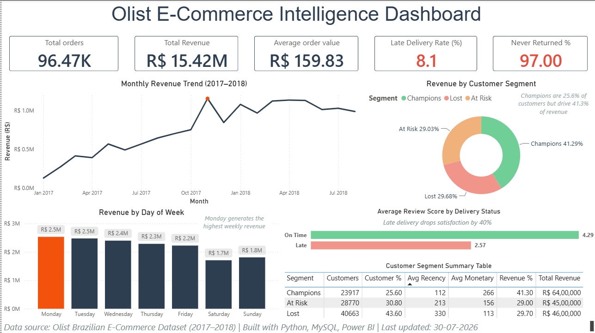

# Olist E-Commerce Intelligence Project

**End-to-end analysis of the Olist Brazilian E-Commerce dataset — from raw data to a decision-ready dashboard.**

This project answers one core business question: *why do 97% of customers never come back after their first purchase, and what should the business do about it?* The same analysis is built independently across three layers — Python for exploration, MySQL for validation, and Power BI for the final decision-making dashboard — to demonstrate the full analytics stack an analyst is expected to operate across.

---

## 📊 Dashboard Preview



---

## 🎯 Business Objective

Olist is a Brazilian e-commerce marketplace connecting small sellers to major retail channels. Despite steady order volume, the business faces a retention problem. This project investigates:

1. How many customers return for a second purchase, and what does that mean for the business?
2. Does late delivery meaningfully hurt customer satisfaction and future purchases?
3. When and how does revenue peak — and how should operations plan around it?
4. Which customers drive the most value, and which are at risk of being lost?

---

## 🔑 Key Findings

| Finding | Insight |
|---|---|
| **Retention Crisis** | 97% of customers never place a second order — only 2,801 of 93,350 unique customers returned. This is an *activation* problem, not a churn problem. |
| **Delivery Impact** | On-time orders average 4.29★ vs. 2.57★ for late orders — a 40% drop in satisfaction. 8.1% of all delivered orders arrived late. |
| **Seasonality** | Revenue grew roughly 9x from January 2017 (R$127K) to a November 2017 Black Friday peak (R$1.15M). Monday is consistently the strongest revenue day. |
| **Customer Value Concentration** | Champions (25.6% of customers) generate 41.3% of total revenue, spending R$266 on average versus R$113 for Lost customers — 2.4x more per customer. |

Full business recommendations for each finding are documented in the [analysis notebook](notebooks/analysis.ipynb).

---

## 🛠️ Approach — Three Layers, One Analysis

This project deliberately rebuilds the same findings across three tools to demonstrate range across the analytics stack.

### 1. Python — Exploratory Analysis
`notebooks/analysis.ipynb`
- Data cleaning, merging, and feature engineering (`total_value`, `days_to_deliver`, `is_late`) using pandas
- Customer journey funnel analysis using `customer_unique_id` — Olist assigns a new `customer_id` per order, so the unique ID is required to track real repeat behavior
- RFM-style customer segmentation using Recency and Monetary only. Frequency was deliberately excluded since 97% of customers purchased only once, making it a near-constant with no analytical value
- All charts generated with matplotlib and seaborn, saved to `images/`

### 2. MySQL — Schema Design and Validation
`sql/queries.sql`
- Raw CSVs loaded and schema hardened: proper `VARCHAR` sizing, `DATETIME` typing (source data used `DD-MM-YYYY HH:MM` format, requiring `STR_TO_DATE()` conversion), primary and foreign keys, and indexes
- All four notebook findings reproduced independently in SQL as a validation step, including RFM quartile scoring via `NTILE()` window functions
- Demonstrates the ability to work directly against a relational database, without a pre-loaded dataframe

### 3. Power BI — Dashboard
`dashboard/final_dashboards.pbix`
- Single-page executive dashboard translating all four findings into a decision-ready view
- KPI cards with conditional formatting flagging problem metrics (Late Delivery Rate, Never Returned %) in red
- Insight callouts on each chart so findings are immediately legible, not just implied by the data

---

## 📁 Repository Structure

```
olist-ecommerce-analysis/
├── notebooks/
│   └── analysis.ipynb          # Full Python EDA, feature engineering, and visualizations
├── sql/
│   └── queries.sql             # Schema fixes, keys/indexes, and analysis queries
├── dashboard/
│   └── final_dashboards.pbix   # Power BI dashboard file
├── images/
│   ├── 01_customer_funnel.png
│   ├── 02_sales_trend.png
│   ├── 03_delivery_impact.png
│   ├── 04_customer_segments.png
│   └── dashboard_screenshot.png
└── README.md
```

> Raw CSV data files are not included in this repository to keep it lightweight. See the Dataset section below to download them.

---

## 📦 Dataset

**Source:** [Brazilian E-Commerce Public Dataset by Olist](https://www.kaggle.com/datasets/olistbr/brazilian-ecommerce) (Kaggle)

This project uses four of the dataset's tables:
- `olist_orders_dataset.csv`
- `olist_order_items_dataset.csv`
- `olist_customers_dataset.csv`
- `olist_order_reviews_dataset.csv`

To reproduce this project, download the dataset from the link above and place the CSVs in a local `data/` folder (excluded from this repository via `.gitignore`).

---

## 🔄 How to Reproduce

**Python analysis**
1. Install dependencies: `pandas`, `numpy`, `matplotlib`, `seaborn`
2. Place the four required CSVs in a `data/` folder at the project root
3. Run `notebooks/analysis.ipynb` top to bottom

**SQL analysis**
1. Create a MySQL database and import the same four CSVs (see schema and import notes in `sql/queries.sql`)
2. Run the queries in `sql/queries.sql` to reproduce each finding

**Power BI dashboard**
1. Open `dashboard/final_dashboards.pbix` in Power BI Desktop
2. Refresh data connections if pointing to a local MySQL instance, or explore the dashboard as-is

---

## 🧰 Tech Stack

`Python` · `pandas` · `matplotlib` / `seaborn` · `MySQL` · `Power BI`

---

## 👤 Author

**Aman Singh**

If you have feedback or questions about this project, feel free to open an issue or reach out.
